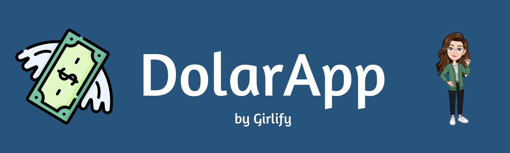
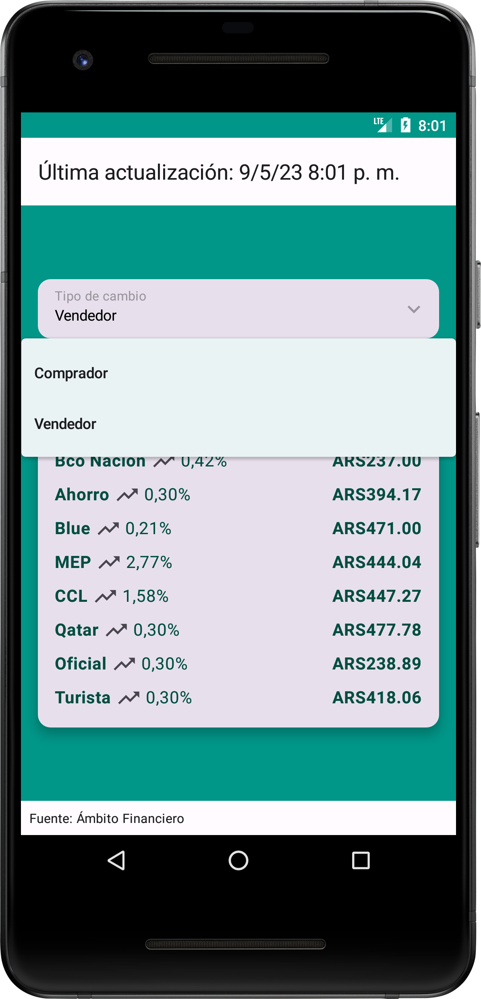
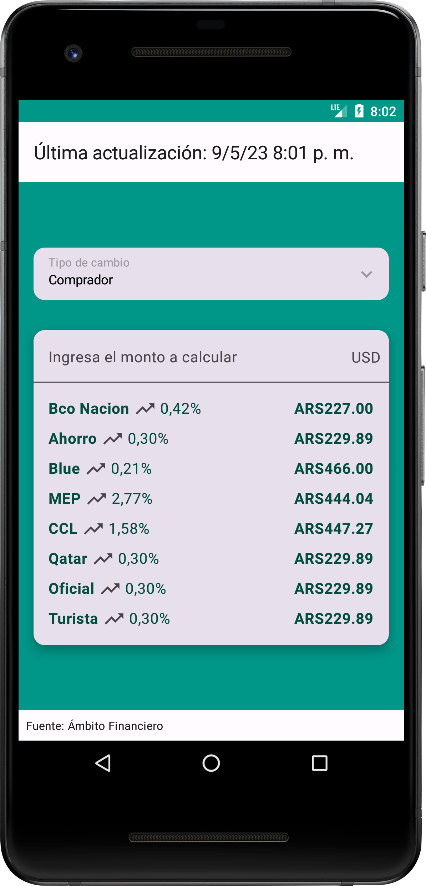
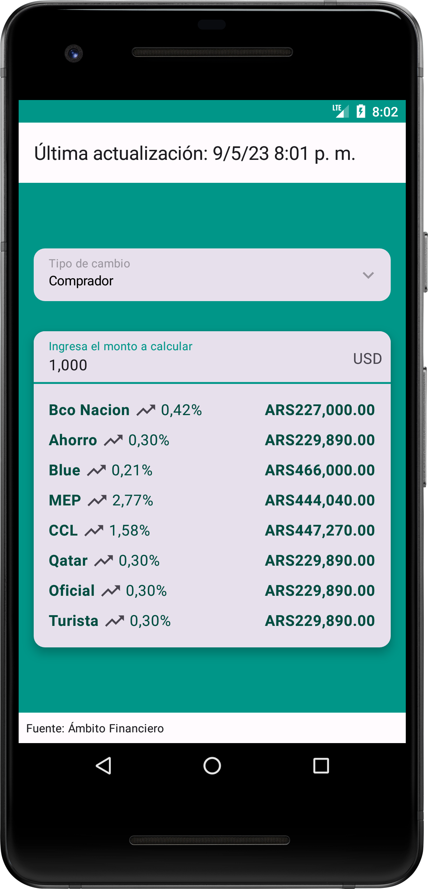
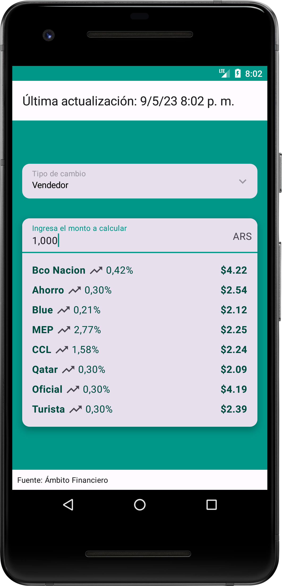

# DOLAR APP 🚀

Proyecto de una aplicación de cotización en tiempo real y conversión de moneda para Argentina.

## Descripción

Este proyecto es una aplicación que permite visualizar las cotizaciones en tiempo real de diferentes
tipos de cambio del dólar en Argentina. La aplicación fue desarrollada utilizando Jetpack Compose y
se implementó siguiendo la arquitectura limpia (Clean Architecture) y MVVM.

Se utilizó Retrofit para hacer la consulta a la API y OkHttp Interceptor para manejar las respuestas
de la API. También se implementó Dagger Hilt para la inyección de dependencias y _StateFlow_ para mantener
la información actualizada en tiempo real. Las corutinas se utilizaron para obtener todas las
cotizaciones al mismo tiempo, ya que cada una debía obtenerse de un endpoint diferente.

Además, se agregó un SplashScreen para ofrecer al usuario una mejor experiencia mientras se carga la
información en la UI.

Por último, la aplicación cuenta con un envío de notificación al usuario, si alguna de las
cotizaciones sufre una variación de +/-5%.

# Demo

## Tecnologías utilizadas

- Jetpack Compose
- Clean Architecture
- MVVM
- Retrofit
- OkHttp Interceptor
- Dagger Hilt
- Flow
- Corutinas
- JUnit y Mock para testeo de unidades y de UI

# Tabla de contenidos

- [Descripción](#descripción)
- [Demo](#demo)
- [Tecnologías utilizadas](#tecnologías-utilizadas)
- [Tabla de contenidos](#tabla-de-contenidos)
- [Instalación](#instalación)
- [Integración continua](#integración-continua)
- [Licencia](#licencia)
- [Footer](#footer)

## Instalación

[(Subir)](#tabla-de-contenidos)

Para instalar y ejecutar la aplicación, es necesario tener Android Studio instalado y seguir los
siguientes pasos:

1. Clonar el repositorio en tu máquina local.
2. Abrir el proyecto en Android Studio.
3. Ejecutar la aplicación en un dispositivo o emulador Android.

## Integración continua

[(Subir)](#tabla-de-contenidos)

Se implementó la integración continua (CI) a través de workflows en GitHub Actions. Se crearon dos
jobs: `build` y `test`.

El job `build` se encarga de construir el proyecto y generar un APK para la distribución.

El job `test` se encarga de ejecutar los test unitarios y de UI.

Ambos jobs se ejecutan en cada push a todas las ramas y el repositorio está configurado para que no
permita mergear los cambios a menos que ambos jobs hayas sido satisfactorios.

Los workflows de CI se encuentran en el archivo `ci.yml` en el repositorio.

## Licencia

[(Subir)](#tabla-de-contenidos)

Este proyecto está bajo la Licencia MIT - ver el
archivo [LICENSE](https://github.com/honeybadger2788/DolarApp/blob/dev/LICENSE) para más
detalles.

# Footer

[(Subir)](#tabla-de-contenidos)

Gracias por llegar hasta aqui! Si quieres hacerme alguna recomendacion o simplemente contactarte
conmigo, puedes hacerlo por cualquiera de estos medios:

- [CV online](https://myporfolio.notion.site/Noelia-Carosella-c0c2f1dbfc8d403e8660356546e90f75)
- [LinkedIn](https://www.linkedin.com/in/noeliabcarosella/)
- [Mail](noe.carosella@gmail.com)
